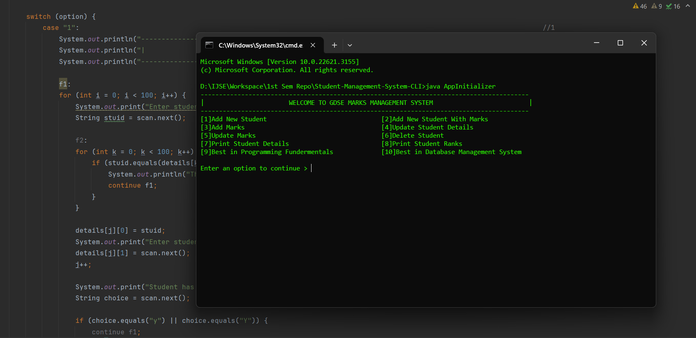

# Student Management System CLI

This is a Command Line Interface (CLI) application designed to manage student information efficiently. It provides
functionalities to add, view, update, and delete student records through simple commands in the terminal. The Student
Management System CLI offers a convenient way for educators and administrators to keep track of student data such as
name, ID, grades, and attendance.

## Tech Stack

✅Java 8 
✅Programming Fundamentals 

## Features

✅Add New Students using Student Id & Name 
✅Add New Students using Student Id & Name with their Marks 
✅Add Student Marks 
✅Search for students Student Id 
✅Update Student Details 
✅Update Student Marks 
✅Delete student records from the system 
✅Print Student Ranks 
✅View a list of all students enrolled in the system along with their respective details 

## Installation

1. Clone this repository to your local machine.
2. Navigate to the project directory.

⭐️If you hava any bugs or issues ,If you want to explain code please contact me on : 
[kavithmathushal9007@gmail.com](https://www.kavithmathushal9007@gmail.com)  

#### This project is licensed under the [MIT License](LICENSE)

#### © 2022 All Right Reserved, Designed By [Kavithma Thushal](https://github.com/Thushal2001)

